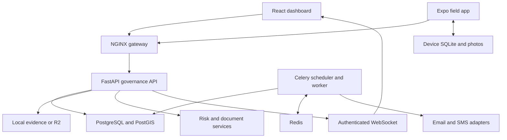
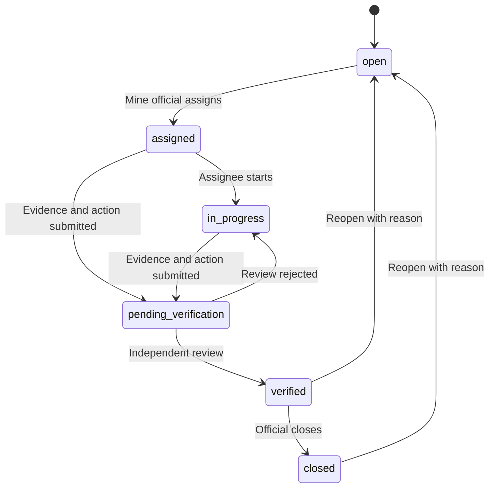

# Architecture

## Runtime arrangement

The web app and Expo app call a common FastAPI API. NGINX serves the web app and routes API/WebSocket traffic in the container deployment. FastAPI authenticates the actual stored user and session on every request, then checks the requested action and mine scope.

For a lightweight Windows run, SQLite replaces PostgreSQL, local files replace R2, and `app.scheduler_local` invokes the same deadline/delivery functions without Redis. These are explicit local deployment options, not a different API implementation.

## Data model

All operational entities reference a mine. Records use UUIDs; the fictional seeds use readable IDs. User roles are controlled through administrative APIs. Local timestamps are converted to UTC at the boundary. Attendance work dates use Asia/Kolkata.

| Table | Main fields / purpose |
|---|---|
| `mines` | Name, subsidiary, state, coordinates, illustrative/approved GeoJSON boundary |
| `users` | Password hash, role, active state, allowed mine IDs, notification contact |
| `auth_sessions` | JWT session ID, user, expiry and revocation |
| `inspections` | Mine, assigned inspector, schedule, checklist, version and results |
| `cases` | Observation/violation/incident, risk, status, assignee, action, verifier, evidence linkage, version |
| `evidence` | Original filename, storage key, uploader, purpose, SHA-256, OCR text and analysis |
| `compliance` | Obligation, official reference URL, evidence owner, deadline, evidence and independent review |
| `permits` | Contractor, work type, precautions, time window, approval and version |
| `attendance` | Mine, user, IST work date, check-in/out, optional coordinates |
| `production_reports` | Unique mine/date/shift, decimal output/dispatch/target, downtime, review state, author and version |
| `grievances` | Reporter, handler, restricted narrative, category/priority, response target, resolution and version |
| `grievance_events` | Authorized conversation/history with fingerprints recorded in the general audit chain |
| `assets` | Mine assets and geographic points |
| `sensor_readings` | Asset/metric/unit/time, source event ID, reading and anomaly explanation |
| `notifications` | User recipient, entity, deduplication key, read and delivery states |
| `audit_logs` | Actor, action, payload, time, previous hash, current hash |
| `audit_heads` | Singleton chain head used to serialize appenders |
| `sync_receipts` | User/operation ID, payload hash and durable response |

The baseline migration is `backend/alembic/versions/0001_initial.py`; revision `0002_operations` adds the production and grievance tables without changing existing tables. PostgreSQL also receives geography views and GiST indexes. `/api/gis/nearby` uses `ST_DWithin`; SQLite uses a bounded Haversine search for local development.

## Corrective-action state machine

The server enforces every transition. Hiding a button is not an authorization mechanism. The assignee must upload corrective evidence before submission. The verifier cannot be the assignee or action submitter. Closure requires verified status and a stored verifier. Reopening clears the active assignment/action/verification fields while historical audit events and evidence remain.

## Synchronization

The field app partitions caches and queues by **server address plus user ID**. Tokens live in SecureStore; operational records live in SQLite. Photo files are copied into app document storage rather than left in the camera cache.

Each mutation has a durable random operation ID. The server stores the hash of the complete operation and its initial response in `sync_receipts`. An identical retry returns the original result. Reusing the ID with changed data produces a conflict. Individual operations in a batch commit independently, so a rejected item does not discard successful neighboring items.

Observation creation receives its case ID before attaching a photo. Corrective work uploads the photo before submitting the action. A per-user upload ID makes evidence retries idempotent. A queue item is deleted only when all required phases are acknowledged. Files are then cleaned up.

Case, compliance, permit, inspection, production and grievance writes check versions. A stale operation returns HTTP 409, or a conflict item inside the sync batch. The field app retains it. The user reviews the current server record before issuing a replacement operation with a new operation ID and version. The web outbox can correct rejected observation drafts without silently changing an acknowledged operation.

## Risk and evidence intelligence

The default case score is `min(100, severity × likelihood × 3 + recurrence + overdue)`. Recurrence contributes three points per other same-category observation in the same mine over 30 days, capped at 15. Overdue contributes 10. The scheduler refreshes these values and audits changes. The mine dashboard shows the **highest open case score**, not a probability or average safety rating.

Sensors use recent values from the same asset, metric and unit. At least ten prior comparable values are required. A median/MAD-based deviation greater than 3.5 produces a review signal. This statistical rule is not a legal methane or dust threshold.

Document analysis keeps the original bytes and extracts candidate text, topics and dates. Retrieval uses local TF-IDF similarity and returns quoted passages with document IDs. The optional language model receives only the question and retrieved passages, with instructions to treat passages as evidence and abstain where evidence is missing. No model has action-execution tools.

## Audit and operating boundaries

A business mutation and its audit append use the same database transaction. An update lock on the singleton audit head serializes chain appenders. Each row hashes its canonical actor, mine, action, entity, payload, timestamp and previous hash. Database triggers reject ordinary update/delete attempts on audit rows.

A privileged database operator could remove triggers and recompute the entire chain. For stronger assurance, retain signed or protected chain-head checkpoints outside the operational database and test recovery against them. The backup helper exports a checkpoint; independent retention is a deployment responsibility.

WebSocket notifications revalidate sessions on each cycle and read per-user records from the shared database. The default implementation uses a ten-second cycle; it does not claim subsecond sensor streaming. Email/SMS delivery is at least once; provider idempotency should be used for integrations where duplicate delivery matters.
